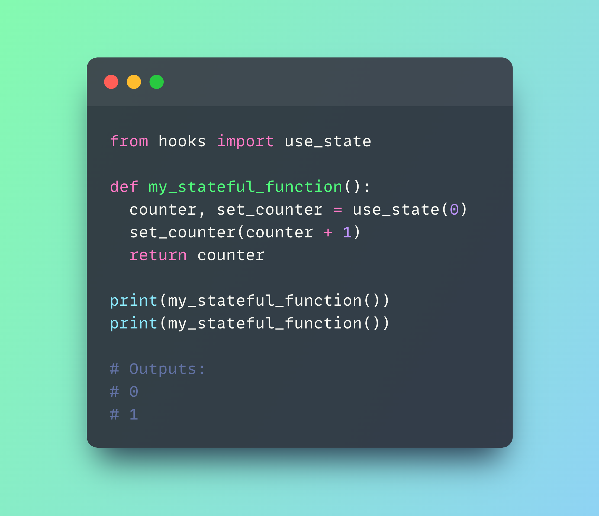
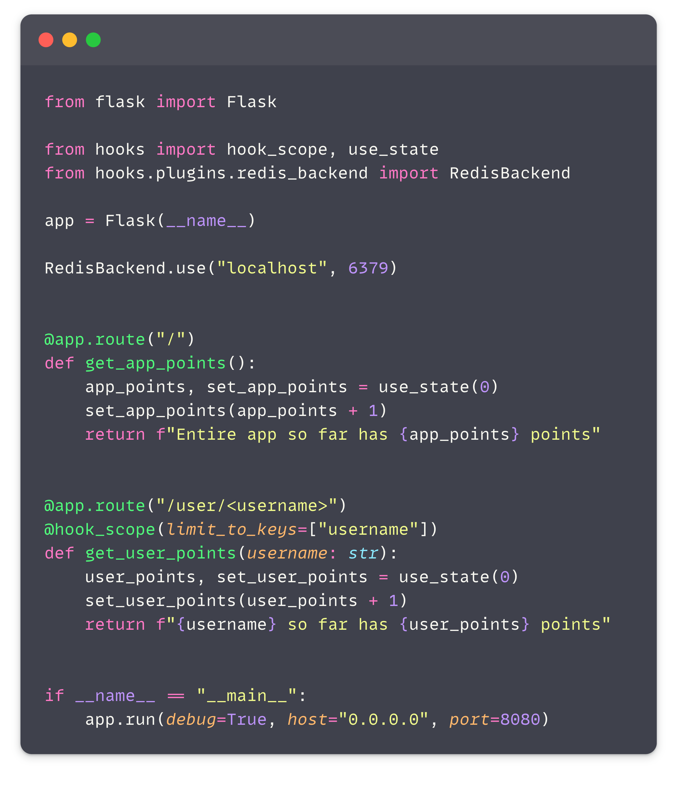

# Python Hooks

<div align="center">

[](https://github.com/amitassaraf/python-hooks/actions?query=workflow%3Abuild)
[](https://pypi.org/project/python-hooks/)
[](https://github.com/amitassaraf/python-hooks/pulls?utf8=%E2%9C%93&q=is%3Apr%20author%3Aapp%2Fdependabot)
[](https://github.com/psf/black)
[](https://github.com/PyCQA/bandit)
[](https://github.com/amitassaraf/python-hooks/blob/master/.pre-commit-config.yaml)
[](https://github.com/amitassaraf/python-hooks/releases)
[](https://github.com/amitassaraf/python-hooks/blob/master/LICENSE)

<a href="https://github.com/amitassaraf/python-hooks/graphs/contributors">
  
</a>
<a href="https://github.com/amitassaraf/python-hooks/issues">
  
</a>
<a href="https://github.com/amitassaraf/python-hooks/pulls">
  
</a>


---


### A React inspired way to code in Python.
</div>

<div align="center">

<br/>
<br/>
<a href="https://github.com/amitassaraf/python-hooks">
  
</a>
</div>
<br/>

* ⚡️ Written with performance in mind __(Not using inspect module)__
* 🐍 Support for familiar React like hooks such as `use_state`, `use_effect`, `use_reducer`, `use_context` and more.
* 🛠️ Built with plugins support and easy to extend.
* 🤝 Python 3.9+ compatibility
* 🪶 Lightweight to remove the need for a lot of boilerplate code.
* 📦 Support for different backend state-stores.
* 🔧 Support for hooks-state scoping.
* 🌎 Redis and Zustand plugins out of the box. 
* 🔌 Tested mainly on CPython.

---

## Inspiration

I'll begin be prefacing that this project will not fit everyone's needs. It's a very opinionated project and it's not meant to be a replacement for any of the existing state management libraries.
Additionally, if you are trying to squeeze the most performance out of Python this is probably not the right tool for you _(Though you might also be using the wrong programming language)_.

The goal of the project is to provide a simple and familiar way to manage state in Python. It's inspired by the React hooks API and it's meant to be used in a similar way. It can be used to manage 
state in a single function or in a large project. The state can be stored in memory, in a database or in a file. It's up to you to decide and the library is easily extendable to support any backend.

One of the inspirations for this project was seeing the way junior developers struggle with state management and program structure in Python. This library is intended to provide a sense of familiarity
to developers coming from the JavaScript world and to provide a simple way to manage state in Python which will not require a lot of boilerplate code or hurt performance.

It is meant to help write better data-driven code and to help developers focus on the business logic of their code rather than on the plumbing.


[**Discord**](https://discord.gg/mayParnv) | [**Docs**](https://amitassaraf.github.io/python-hooks/) 


Note: This project is still in beta and is not recommended for production use just yet. We are working on adding more tests and improving the documentation. If you are interested in contributing, please reach out to me on [Discord](https://discord.gg/mayParnv).

---

## Let's see one API example

As Python is commonly used to create APIs, I wanted to provide one real-world example of using hooks for state management in Flask. Note, that this is just one example and the library can be used in many other ways. See [examples](https://github.com/amitassaraf/python-hooks/tree/master/examples)
 for more examples.



### Pretty neat, right?


## 🚀 Installation

```bash
pip install python-hooks
```

## 🎯 What's next

Well, that's up to you 💪🏻. We are looking for contributors to help us build this project and make it better. If you are interested in contributing, please reach out to me on [Discord](https://discord.gg/mayParnv) or open an issue. 
In addition we are looking for plugin developers to help us build more plugins for different state stores.

## 📈 Releases

You can see the list of available releases on the [GitHub Releases](https://github.com/amitassaraf/python-hooks/releases) page.

We follow [Semantic Versions](https://semver.org/) specification.

We use [`Release Drafter`](https://github.com/marketplace/actions/release-drafter). As pull requests are merged, a draft release is kept up-to-date listing the changes, ready to publish when you’re ready. With the categories option, you can categorize pull requests in release notes using labels.

### List of labels and corresponding titles

|               **Label**               |  **Title in Releases**  |
| :-----------------------------------: | :---------------------: |
|       `enhancement`, `feature`        |       🚀 Features       |
| `bug`, `refactoring`, `bugfix`, `fix` | 🔧 Fixes & Refactoring  |
|       `build`, `ci`, `testing`        | 📦 Build System & CI/CD |
|              `breaking`               |   💥 Breaking Changes   |
|            `documentation`            |    📝 Documentation     |
|            `dependencies`             | ⬆️ Dependencies updates |


GitHub creates the `bug`, `enhancement`, and `documentation` labels for you. Dependabot creates the `dependencies` label. Create the remaining labels on the Issues tab of your GitHub repository, when you need them.


## 📋 Roadmap

- [ ] Finish documentation
- [ ] Improve frame identifier without hurting performance
- [ ] Develop state-debugger plugin
- [ ] Add redux plugin
- [ ] Async support ⚡
- [ ] Additional hooks
    - [ ] use_ref 
- [ ] Test and adapt to PyPy, Jython, IronPython
- [ ] Support for more hook backends
    - [ ] MongoDB
    - [ ] Postgres
    - [ ] MySQL
    - [ ] SQLite
    - [ ] File
- [ ] More tests

See the [open issues](https://github.com/amitassaraf/python-hooks/issues) for a full list of proposed features (and known issues).

## 🛡 License

[](https://github.com/amitassaraf/python-hooks/blob/master/LICENSE)

This project is licensed under the terms of the `MIT` license. See [LICENSE](https://github.com/amitassaraf/python-hooks/blob/master/LICENSE) for more details.

## 📃 Citation

```bibtex
@misc{python-hooks,
  author = {Amit Assaraf},
  title = {A React inspired way to code in Python},
  year = {2023},
  publisher = {GitHub},
  journal = {GitHub repository},
  howpublished = {\url{https://github.com/amitassaraf/python-hooks}}
}
```
