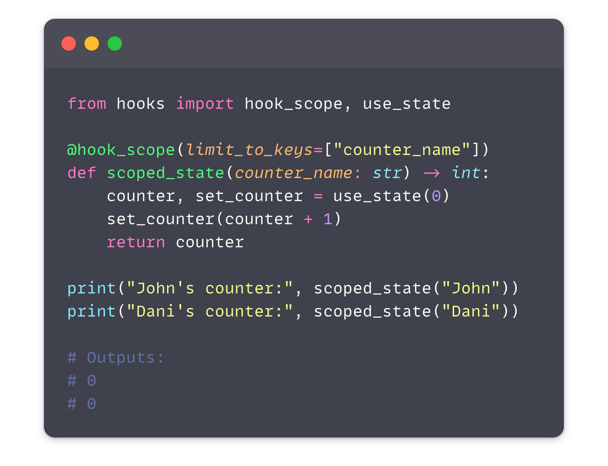
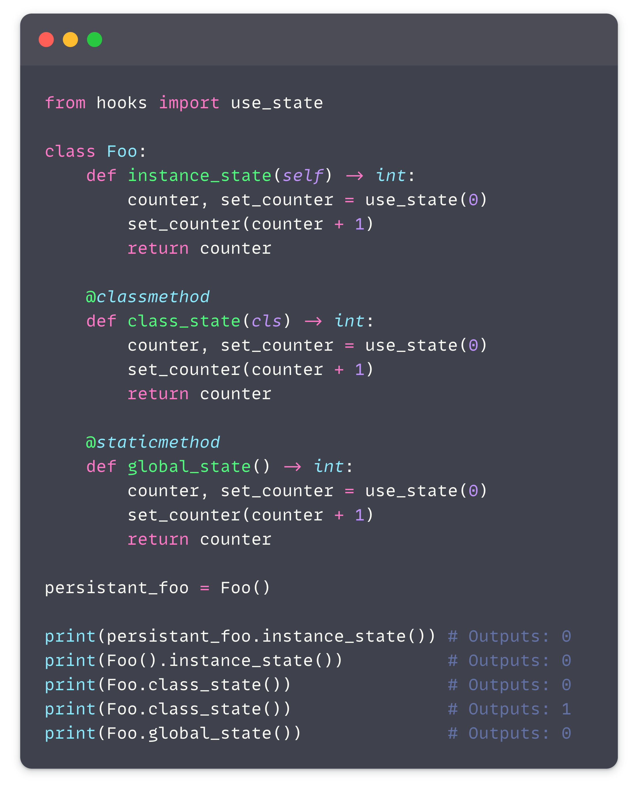

# Getting Started

For full documentation visit [mkdocs.org](https://www.mkdocs.org).

## Commands

* `mkdocs new [dir-name]` - Create a new project.
* `mkdocs serve` - Start the live-reloading docs server.
* `mkdocs build` - Build the documentation site.
* `mkdocs -h` - Print help message and exit.

## Project layout

    mkdocs.yml    # The configuration file.
    docs/
        index.md  # The documentation homepage.
        ...       # Other markdown pages, images and other files.

### Let's see some more 

One thing which is different from React is that the hooks can be scoped to function arguments. This allows you to have multiple instances of the same function with different state.

In addition, hook state scope will behave exactly like you expect, on instance methods the state will be scoped to the instance, 
on classmethods it will be scoped to the class, and on staticmethods it will be scoped globally.

